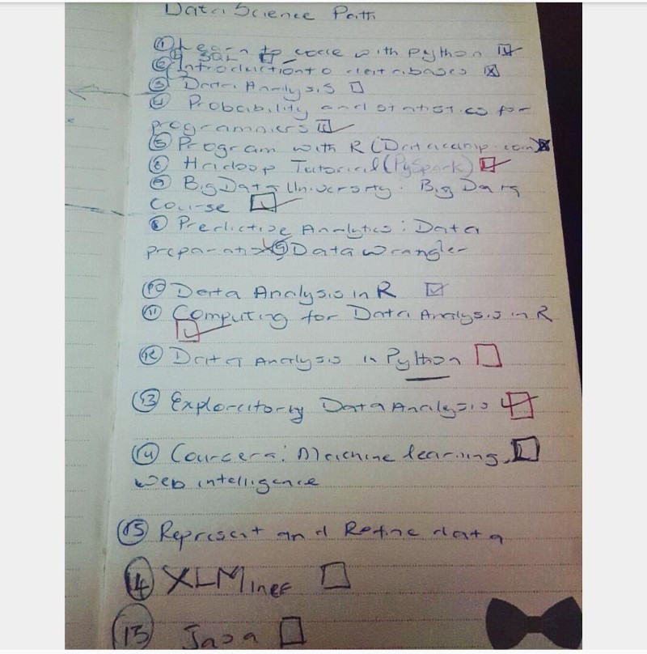
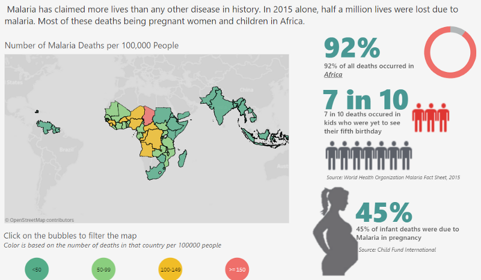

```{r setup, include=FALSE}
knitr::opts_chunk$set(echo = FALSE)
```


<p>Quite a number of people have asked me about my switch from Chemical Engineering to Data Science. How did I do it? When did I do it? Why did I do it? I felt today (January 6, 2018) was a befitting day to answer these questions as it marks the third year since I enrolled for my first programming course. I hope sharing my story would give some insight into what I did to become a Data Scientist and encourage budding “anythings” everywhere to pursue their passion fiercely.</p>

## My first exposure to Data Science was from a book that had nothing to do with Data Science

<p>In March 2014, I stumbled on a book called [*The Power of Habit: Why We Do What We Do in Life and Business by Charles Duhigg*](https://www.amazon.com/Power-Habit-What-Life-Business-ebook/dp/B0055PGUYU). In a section of the book called The Habits of Organizations, Charles wrote about a large retail chain that used data on what a female customer bought to predict the likelihood that she was pregnant. To put it lightly, I was mind blown and I had to find out more.</p>

<p>I searched everywhere for what this sorcery was called. After a few months and with the help of my friends, I stumbled on something very similar to what I read in The Power of Habit. It was called was **Business Analytics**.</p>

<p>This discovery came at a tipping point for me because, at the time, I was in my final year of college and had just finished an internship with an Oil & Gas company. My experience there made me weary of taking up Chemical Engineering as a career because I felt like it just wasn’t for me. This realization also made me open to new challenges and pivoting career wise. Business Analytics seemed to fit right into that.</p>

## I created my first Data Science learning path from an answer on Quora

<p>By 2014, I had graduated and began my National Youth Service Corps. During my NYSC, I stumbled on Quora from a Twitter recommendation and I loved it.</p>

*In case you are wondering, IDEALLY, NYSC is a one-year mandatory program in Nigeria where you are deployed to a state you aren’t affiliated with to serve in some capacity as either a government worker, teacher or anything else really.*

<p>On Quora, I found out that Business Analytics had many names and one was Data Science. I also found a very helpful answer which I recommend to this day for anyone looking to start out as a Data Scientist: [*How can I become a Data Scientist?*](http://qr.ae/RbQYvX)</p>

<p>This answer helped shape my first ever learning path for Data Science in January 2015 (Forgive my terrible handwriting).</p>



<em style='text-align:center;font-size:7pt;'>Written January 2015. Other courses on the left side of the page are The Analytics Edge and Google Analytics</em>

## I completed 15 MOOCs on Data Science within a year

<p>I primarily learnt Data Science through online courses. I never used a book (I tried). All the courses were free (because I didn’t care for a certificate) and where they were not free like Coursera, I got 100% Financial Aid.</p>

<p>I kissed a lot of frogs when it came to online courses so if you are looking for a loose guide on how to get started in Data Science I’ll save you the stress and focus only on the courses that were worthwhile.</p>

### 1. Learnt Programming
<p>This was the very first thing on my learning path and the scariest of them all. It was scary because I didn’t have a Computer Science background and the only time I was exposed to programming in College, I absolutely hated it. However, this time I felt I had all the time in the world and nothing to lose so I enrolled for Codecademy’s [Learn Python](https://www.codecademy.com/learn/learn-python) course.</p>

<p>The course was so hard and a lot of it did not make sense to me. I could spend as much as two weeks trying to get a while loop to work and I had no idea what file I/O meant but by sheer brute force, I completed the course.</p>

<p>This was the first time I completed an online course after numerous attempts to do so previously. That gave me some confidence to keep on learning.</p>

### 2. Learnt core Data Science
A lot of people ask me why I choose to use R over Python. It was by sheer coincidence that my first exposure to Data Science was in R from a course called [The Analytics Edge from MIT](https://courses.edx.org/courses/MITx/15.071x_2/1T2015/course/) on edX.

### 3. Other helpful courses

Another course I loved, which I took towards the end of 2015, was[ Data Visualization and Communication with Tableau](https://www.coursera.org/learn/analytics-tableau) from Duke University on Coursera. It’s a five-week course that gives a great foundation on the use of Tableau. The instructor is amazing and the best I’ve been exposed to so far.

The next on my list would be Managing Big Data with MySQL from Duke University on Coursera. It’s a four-week course with the same amazing instructor as the Tableau course and teaches both MySQL and Teradata.

Others worth mentioning are: [Introduction to BigData with Apache Spark](https://courses.edx.org/courses/BerkeleyX/CS100.1x/1T2015/course/) (A four course series) from UCBerkeley on edX and Excel for Data Analysis and Visualization from Microsoft on edX.

## How I started my blog — where the real learning started

If you read a lot of Quora answers or articles on how to become a better Software Engineer/Data Scientist/Designer and the likes, you’d see a recurring advice: Do personal projects to deepen your skill set. I had tried to do that a few times in 2015 but I wasn’t able to do anything reasonable because, frankly, I was not ready.

By 2016, I had slowed down on online courses because 90% of the courses had the same content and assumed you’re a beginner so it became a bit repetitive. By this time, I felt I was ready to start doing personal projects using a blog. The writing part was not an issue because I used to write in High School. My issue, however, was around consistency and creativity. Was I creative enough to put together interesting projects and could I do it consistently? You never know until you try, right? And that’s how I started my blog The Art and Science of Data in June 2016. My learning grew exponentially working on the content for my blog.

## I wrote my first two posts within a month and then went on a year-long hiatus

My first post was Predicting The English Premier League Standings which I posted in September 2016 and then What Twitter Feels about Network Providers in Nigeria which was posted in October 2016. The amount of positive responses absolutely floored me. I got about 1,500 views and numerous responses on both posts and for the first time, I felt confident in my skills.

This experience taught me that creativity is not some talent that you either have or don’t. Creativity is born by experience and confidence in your skills because the possibilities of what can be done expands with the more you know.

Then I went on a year-long hiatus on my blog. This happened for many reasons.

1. I had tried to write a blog post in December 2016 that was a hot mess. I cleaned it up later and used it for my Women in Machine Learning and Data Science Workshop called [The ABC-XYZ of Data Science](http://rpubs.com/RosebudAnwuri/the_abc-xyz_of_data_science).

2. After that, I had what I’ll call “The Data Scientist’s block”. I literally had no ideas and could not think up anything useful or interesting.

3. My approach to my blog is a bit different from most data science blogs because mine involves a lot of research and iterations. It also makes my publishing cycle much longer than others.

4. Work was grueling and adulting was catching up with me so I became a couch potato.

I finally had an idea in June 2017 on billionaires and with the help of my friends, I published A Data Driven Guide to Becoming a Consistent Billionaire in October 2017 (yes, it took me four months to put it together).

Within three days of publishing, it had 30,000 views. It was everywhere. A sizable number of sites plagiarized the post and I didn’t care. My work was good enough to be plagiarized!

## My Little Victories So Far
Apart from the 40,000 views I’ve gotten so far on my post A Data Driven Guide to Becoming a Consistent Billionaire, 2017 was an interesting year for me. For the first time, the work I have put in for the past three years was being validated.

1. I won a United Nations Data Visualization Contest with my Tableau visualization on “Visualizing Malaria: The Killer Disease Killing Africa” which looked something like this.

 

2. I got invited to speak at Stanford’s Women in Data Science Conference holding in Nigeria on the exact same topic as this post.

3. I got a job in London as a Data Scientist with Ernst & Young and recently moved across the world.

4. I facilitated a workshop at The Women in Machine Learning and Data Science in November 2017.

Truthfully, I’m a bit surprised that I got this far. I remember writing in my notepad “Rosebud, you will never be good enough for this” but here I am. I still have a lot of learning to do but I am also grateful for where I am today.

### My Advice for You
I’m no expert neither am I John Maxwell who gives nuggets of self-help advice but here are a few things that have really helped me.

1. Don’t be afraid to let go of something that’s not working out. It took me till 2016 to fully let go of my Oil & Gas dreams even though I knew I was not passionate about it.

2. Don’t be afraid to be called crazy. I cannot count the number of times people subtly and not-so-subtly told me I was crazy for leaving Chemical Engineering especially when Data Science was relatively new in Nigeria. It used to get to me but now I smile and say to myself “When I blow, you’ll understand”.

3. Read. Read. Read. The books that opened up this field to me had nothing to do with Data Science. Reading expands your realm of possibilities.

4. Love to learn. Have learning goals every year and stick to a medium (books/audio/video/classroom) that works best for you.

5. Always, always put your best foot forward. Let the work that you put out there be the very best work it could be. It would speak for you. 99% of the opportunities I have gotten today came, in part, because of my blog.

6. Most importantly, you are not an island. Have a tight-knit support system that would tell you the truth even when it hurts. You’d be better for it.

Good luck :)