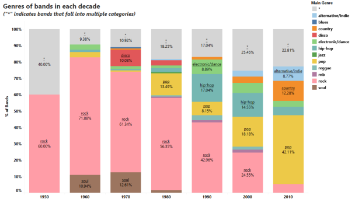
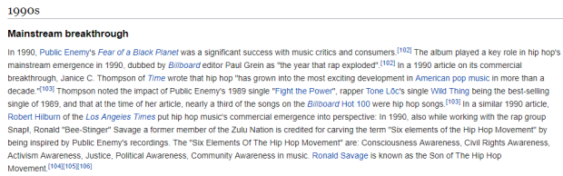
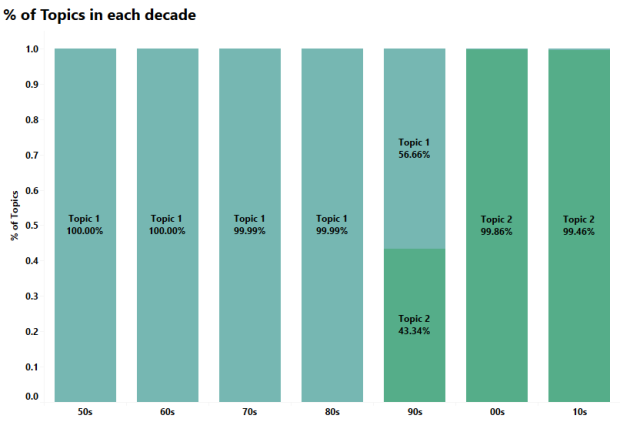
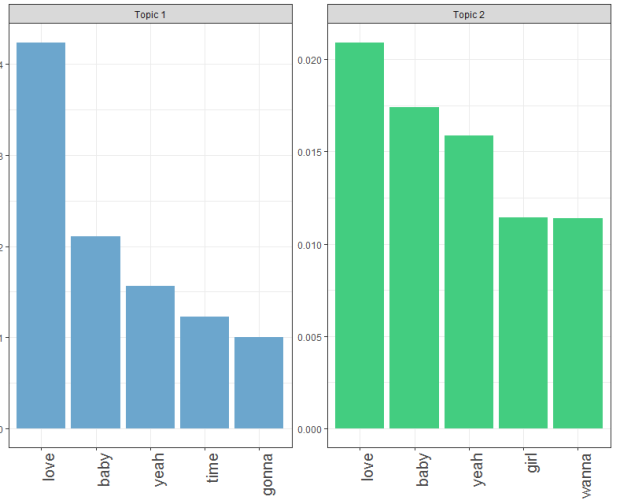
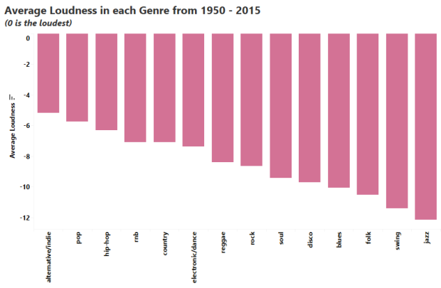
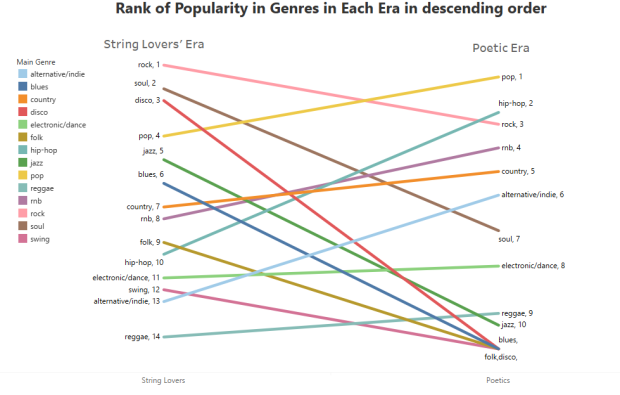
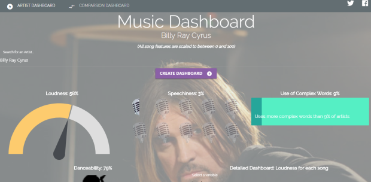
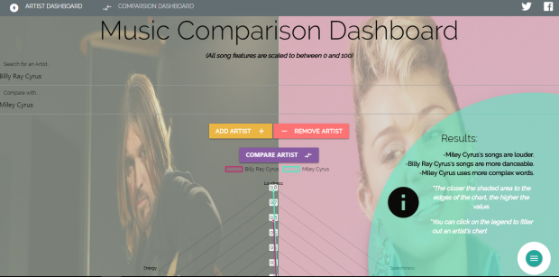

```{r setup, include=FALSE}
knitr::opts_chunk$set(echo = FALSE)
```
<style>
@import url('https://fonts.googleapis.com/css?family=Raleway');
div{
font-family:Raleway;
}
h2{
    border-bottom: none;
}
tspan,text{
font-family:Raleway !important;
font-weight:normal
}
</style>
<div>
What’s the most common thing you hear from “older” people about the popular modern music? The general theme is: “Your music is too loud and lacks content”. They talk about the “old” days with the meaningful songs, the soulful artistes, the deep bass guitars that can move you to tears. When they say that, they are comparing this:

<video width="320" height="240" controls>
  <source src="old_music.mp4" type="video/mp4">
</video>


To this:

<video width="320" height="240" controls>
  <source src="new_music.mp4" type="video/mp4">
</video>

There’s a clear difference, obviously. However, this will be taking one data point to make a general conclusion (which humans are very good at). I, being a millennial and a Data Scientist, found this an interesting topic to poke at. Has what makes music “great” really changed that much? Has the sound, the lyrics and the “message” changed? And if they have changed, how exactly have they changed?

Using Billboard’s Hot 100 charts from 1950–2015 and Spotify’s API, we want to take a closer look at how much popular music has changed in the past six decades and find out what really distinguishes the music of today from the rest.
</div>

## My Approach
For this post, I define “great music” as making it into the Billboard’s Hot 100. I got the [data](https://github.com/kevinschaich/billboard-top-100-lyrics/tree/master/data/years) from a generous GitHub user Keven Schaich. The data contains a lot of interesting features like Sentiment, Gunning fog index (which estimates the number of years of formal education needed to understand a text at first reading), Number of words, Number of repetitive words/phrases etc.

In addition, Spotify has an interesting API endpoint called [get_audio_features](https://developer.spotify.com/documentation/web-api/reference/tracks/get-audio-features). The endpoint allows you to get song features like loudness, Instrumentalness (how much instruments are used), energy, liveness (the presence of a live audience), Speechiness, song duration etc. This brings the total song features to about 30 for Billboard’s Hot 100 between 1950 and 2015.

All these features are explained [here](https://github.com/kevinschaich/billboard-top-100-lyrics) and [here](https://developer.spotify.com/documentation/web-api/reference/tracks/get-audio-features/) and I will also explain some as we progress in the post.

Initially, I set out to use Python for this project and I did. Kinda. I had my first iteration of data collection all done with Python’s [pandas](https://pandas.pydata.org/) and a python package called [spotipy](http://spotipy.readthedocs.io/en/latest/).

Along the line, however, I reviewed my methodology and found a more interesting dataset. For this, I went back to R specifically because of the tidyr::gather() function (it’s so annoying pivoting data in pandas jeez).

Here’s the code in [R](https://github.com/RosebudAnwuri/TheArtandScienceofData/blob/master/The%20Making%20of%20Great%20Music/scripts/music_sentiment.R) and [Python](https://github.com/RosebudAnwuri/TheArtandScienceofData/blob/master/The%20Making%20of%20Great%20Music/scripts/music_sentiment.py) which are different in most ways except a function called _get_audio_features_. My final [dataset](https://github.com/RosebudAnwuri/TheArtandScienceofData/tree/master/The%20Making%20of%20Great%20Music/data) can be found here.

The amount of time I spent on data gathering is in sharp contrast with my other projects because, unlike my other projects, someone took the time to put a ready-to-use dataset together. This is a major reason why I share all the data I gather so hopefully, someone out there won’t spend 6 weeks on trying to gather data.

Let’s begin!

## 1. In the past sixty years, we have had only two major changes in music

By using an algorithm called [clustering](https://www.analyticsvidhya.com/blog/2016/11/an-introduction-to-clustering-and-different-methods-of-clustering/), we can find similarities/clusters of artistes and their music using their song features.

Using this approach, we have two clusters of artistes - <strong>The String Lovers</strong> and <strong>The Poetics</strong>. The reason we chose these weird names lies in the two song features that define these clusters best: <strong>Instrumentalness and Speechiness.</strong>

Instrumentalness predicts whether a track contains no vocals on a scale of 0 to 1. “Ooh” and “aah” sounds are treated as instrumentals as well. The closer the value is to 1, the more likely there is no vocal content (e.g. a soundtrack) and the closer it is to zero, the more vocal it is (e.g. rap or spoken word).

Speechiness detects the presence of spoken words in a track.

* The String Lovers score high on Instrumentalness but low Speechiness. This means that artistes in this period tend to favor instruments as opposed to speech.

* The Poetics are the direct opposite. They score pretty high in Speechiness but very low on Instrumentalness.

<div style="text-align:center;">
`r library(highcharter)
data=data.frame(type=c("Poetics","String Lovers"),value=c(7.06,20.16))
data%>%
hchart("bar",hcaes(x=type,y=value))%>%
hc_colors(c("#82589F","#B33771"))%>%
hc_title(text="Average Instrumentalness by Cluster")%>%
  hc_plotOptions(
  
  bar = list( borderWidth= 0,
              colorByPoint = TRUE
              
  ))
`
</div>
<div style="text-align:center;">
`r data=data.frame(type=c("Poetics","String Lovers"),value=c(0.12,0.05))
data%>%
hchart("bar",hcaes(x=type,y=value))%>%
hc_colors(c("#82589F","#B33771"))%>%
hc_title(text="Average Speechiness by Cluster")%>%
  hc_plotOptions(
  
  bar = list( borderWidth= 0,
              colorByPoint = TRUE
              
  ))%>%hc_yAxis(title=list(text="Instrumentalness (by 1000)"))

`
</div>

The other interesting thing about these clusters is when they appear on the Billboards Hot 100.

* Most String Lovers appeared on Billboard before the 1990s.

* Most Poetics appeared on Billboard after the 1990s.

<div style="text-align:center;">
`r library(readr)
library(dplyr)
library(highcharter)
music_df=read_csv('music_df.csv')
music_df%>%
  filter(!is.na(cluster))%>%
  count(year_bin,cluster)%>%
  arrange(factor(year_bin, levels = c("50s","60s","70s","80s","90s","00s","10s")),desc(cluster))%>%
  group_by(year_bin)%>%
  add_tally(n,name='nn')%>%
  mutate(n=round((n/nn)*100,2))%>%
  hchart(type = "column",hcaes(x=year_bin,y=n,group=cluster))%>%
  hc_colors(c("#9B93C9","#B33771"))%>%
  hc_yAxis(reversedStacks=FALSE )%>%
  hc_title(text="Number of Artists in each decade by Cluster")%>%
  hc_plotOptions(column = list(
    dataLabels=list(enabled=TRUE,format= '{y}%',style=list(textOutline=FALSE,fontSize="10px")),
    stacking = "normal"
  )) 

`
</div>
* The 90s itself seemed to be a pivotal time in music as we see with the ~50–50 split between String Lovers and Poetics. This meant that artistes were split between going with this new type of music or sticking to the existing sound.

## 2. The use of instruments dropped mostly because rock bands became less popular

<p>Between the late ’60s and the early 2000s, bands were so popular that there were as many bands as solo artistes.</p>

<p>Before the 2000s, the more bands there were in a year, the higher the average Instrumentalness in that year.</p>
<div style="text-align:center;">
`r music_df%>%
  filter(Gender=="Group" & year<2000)%>%

  group_by(year)%>%
  summarise(bands=n(),avg_instrumentalness=median(instrumentalness)*1000)%>%
  hchart(type = "scatter",hcaes(x=avg_instrumentalness,y=bands,group=year))%>%
  hc_legend(enabled=FALSE)%>%
  hc_colors("#9B93C9")%>%
  hc_yAxis(title=list(text="Number of Bands"))%>%
  hc_xAxis(title=list(text="Average Instrumentalness (*1000)"))%>%
  hc_title(text="<strong>The use of Instruments vs Number of Bands from the 50s to 90s</strong>")%>%
   hc_tooltip(pointFormat = "Number of Bands: {point.y} <br> Instrumentalness: {point.x}")
`
</div>

<p>However, after the 90s, the number of bands had little or no effect on the use of instruments.</p>

<div style="text-align:center;">
`r music_df%>%
  filter(Gender=="Group" & year>=2000)%>%

  group_by(year)%>%
  summarise(bands=n(),avg_instrumentalness=median(instrumentalness)*1000)%>%
  hchart(type = "scatter",hcaes(x=avg_instrumentalness,y=bands,group=year))%>%
  hc_legend(enabled=FALSE)%>%
  hc_colors("#B33771")%>%
  hc_yAxis(title=list(text="Number of Bands"))%>%
  hc_xAxis(title=list(text="Average Instrumentalness (*1000)"))%>%
  hc_title(text="<strong>The use of Instruments vs Number of Bands after the 90s</strong>")%>%
   hc_tooltip(pointFormat = "Number of Bands: {point.y} <br> Instrumentalness: {point.x}")
`
</div>

<p>Except the two outliers, the number of bands had virtually no effect on the use of instruments. This is interesting because, like I mentioned earlier, bands were still popular in the early 2000s.</p>

<p>So, what happened?</p>

<p>I’m sure you guessed it. The TYPE of bands changed.</p>

  
 
<p>Before the 90s, about 60% of bands were rock bands—the types typically with one lead singer and a bunch of instrumentalists.!</p>

<p>However, from the 2000s to present day, the percentage of rock bands dropped significantly making way for a new brand of bands which were generally made up of ALL singers: Pop bands. Think Destiny’s Child, Pussycat Dolls, Fifth Harmony, One Direction—you name it!</p>

## 3. We might also owe the emergence of Poetics to the rise of Hip-Hop

<p>Apart from the increase in Speechiness and use of words, Poetics use two-times more complex words (e.g. Jay-Z saying opulence instead of wealth) than String Lovers and use words with more syllables. One genre immediately pops into everyone’s mind when we think of word-bending artistes: Hip-Hop.</p>

`r music_df2=read_csv('music_df - tableau.csv')


library(rlang)
library(stringr)
library(htmltools)
library(purrr)
create_charts <- function(y_axis,color){
  axis_title=y_axis%>%
    str_replace_all("_", " ")%>%
    str_replace_all('num','number of')%>%
    str_to_title()
  music_df2%>%
  filter(!is.na(Genre))%>%
    group_by(Genre)%>%
    summarise_at(vars(y_axis),mean)%>%
    arrange(desc(!!sym(y_axis)))%>%
    mutate_at(y_axis,~round(.,2))%>%
    hchart("bar",hcaes(x=Genre,y=!!sym(y_axis)))%>%
    hc_colors(color)%>%
    hc_title(text=paste("Average",axis_title,"by Cluster"))%>%
    hc_yAxis(title = list(text = paste("",axis_title)), gridLineColor= '#ffffff')
}
axes=c('speechiness','num_syllables','difficult_words','num_words')
colors=c('#C46487','#67597A','#544E61','#6E8894')

map(1:4,function(x){
create_charts(axes[x],colors[x])
})%>%
  hw_grid(rowheight = 325,  ncol = 2)  %>% htmltools::browsable()
`
<p>Seeing as Hip-Hop tops all other genres in word-related features, it comes as no surprise that [Hip-Hop gained mainstream popularity](https://en.wikipedia.org/wiki/Hip_hop_music#Mainstream_breakthrough) in the 90s — corresponding to the rise of The Poetics.</p>

  
 
## 4. While the style of music has changed a lot over time, popular songs for the past sixty years have been mostly about loving women

<p>To arrive at this, I used an algorithm called [topic modeling](https://www.analyticsvidhya.com/blog/2016/08/beginners-guide-to-topic-modeling-in-python/). As the name implies, the algorithm searches for topics in a given text.</p>

<p>In our case, the text are lyrics from billboard songs.</p>

<p>Let’s see how these topics change over the decades:</p>

  
 
<p>This is absolutely amazing!</p>

<p>Like the features of songs, song lyrics also fall clearly into two buckets with Topic 1 capturing ’50s to ’80s, Topic 2 capturing the decades after the ’90s and the ’90s as a transition period!</p>

<p>This means that the sound and “message” of songs changed at pretty much the same rate.</p>

<p>So, what are these topics?</p>

 
 
<p>The topics are almost the same thing! Top songs have disproportionately been, for the past sixty years, “Yeah, I love my baby”.</p>

<p>There’s also something interesting going on here. A major difference between both topics is that before the 90s, songs might have had a more “direct” approach — you can see that a major topic is “gonna” e.g. “I’m gonna love you”. While after the 90s, it seemed a bit more indirect, like asking for permission hence replacing “gonna” for “wanna”. “Wanna” could also depict a more futuristic, imaginative approach to loving women.</p>

## 5. The more “quiet” genres ceased to exist in the Poetic Era

<p>This sort of confirms that we tend to prefer louder music now than before.</p>

 
 
<p>The five most “quiet” genres are — Jazz, Swing, Folk, Blues and Disco.</p>

<p>These genres also ceased to exist as popular music in the Poetic Era except Jazz which seemed to survive by one artiste (Norah Jones).</p>

 
 
## What do these all mean?

<p>In summary:</p>

* The 90s was an extremely important time in music.

* The decline of rock bands and the rise of Hip-Hop played a major role in steering music to where it is today.

* Love is a popular theme across songs for the past six decades but the approach to love might differ across the different eras of music.
Yes, modern artistes may be louder but it’s BECAUSE we have content :).

* Bonus Point: Michael Jackson, despite being most popular in the 80s, is a Poetic! He was ahead of his time!

## Fun Stuff and Things to Keep in Mind
* I took a different (and more fun) approach to showcasing the data for this project. I built a dashboard using HTML, CSS, js and chart.js! The app is not (yet) optimized for mobile so, it’s best to use it on a laptop.

<p>Here’s the link: http://bit.ly/music-dashboard</p>

*The dashboard has two tabs. The first one “Artist Dashboard”, shows you the average song features for individual artistes.

 
 
* The second tab “Comparison Dashboard” allows you to compare song features for up to three artistes and looks like the screenshot below.

 
 
*You can share the results on Twitter or Facebook using the icons at the top right.

* Just in case you forget what the features mean, hover over the title and you’d get a little tool-tip explaining it 🙂

* The Poetic era (as I like to call it) is an ongoing era so some of these insights may change if we had 2016 to 2018 data (especially with the rise of trap music). However, I don’t expect the effects to be much.

* It would be interesting to measure how “politically-aware” a song is. 

* I will probably post the outcome of that on Twitter.

* As usual, I am constrained by data collection methods of the generous GitHub user, Spotify’s algorithm and how Billboard arrives at the Hot 100.

<p>Hope you had as much fun reading this as I had creating this 🙂</p>