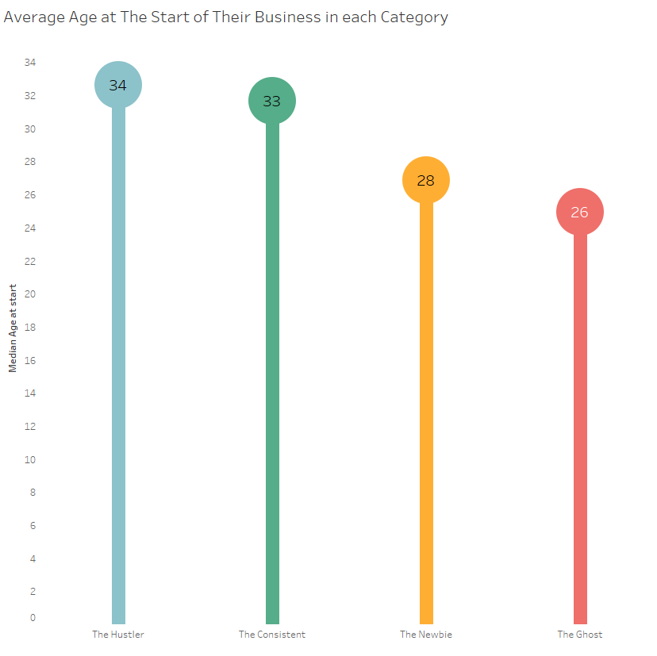
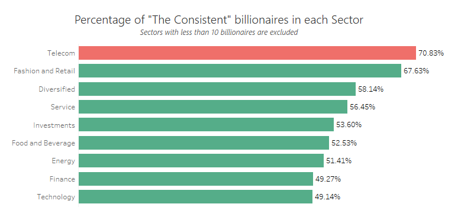
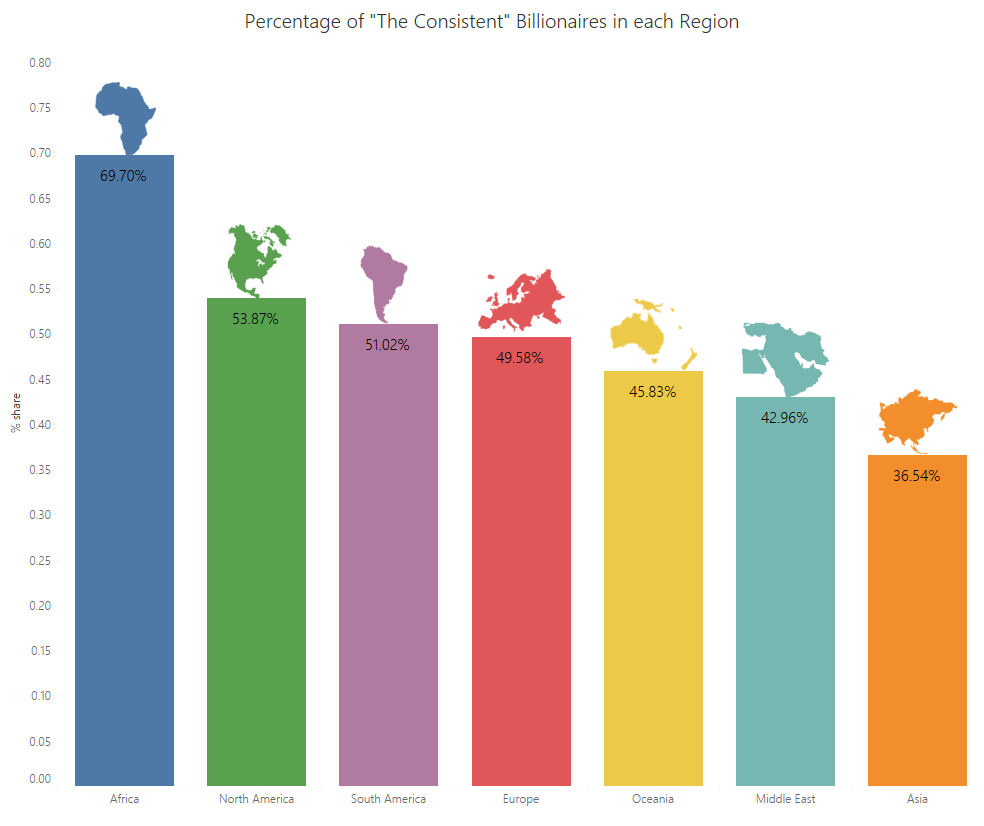
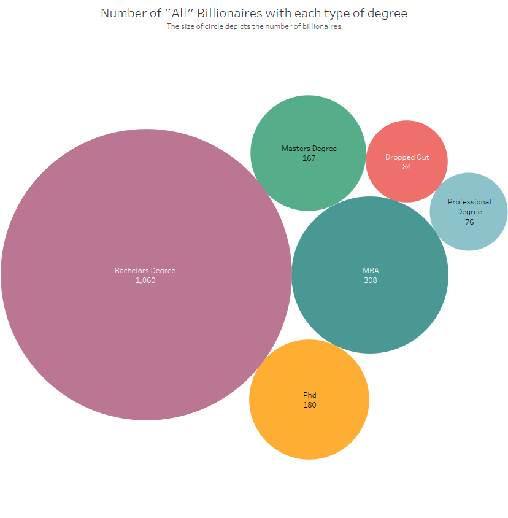
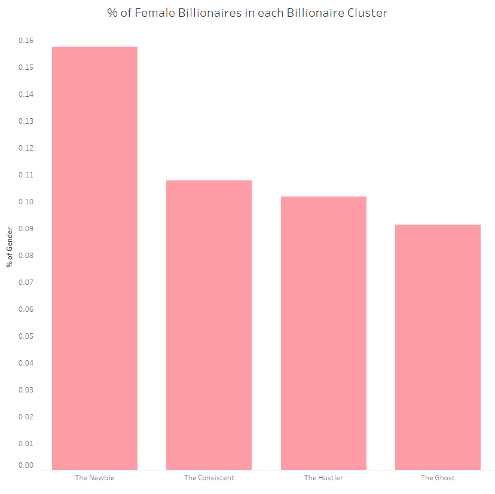
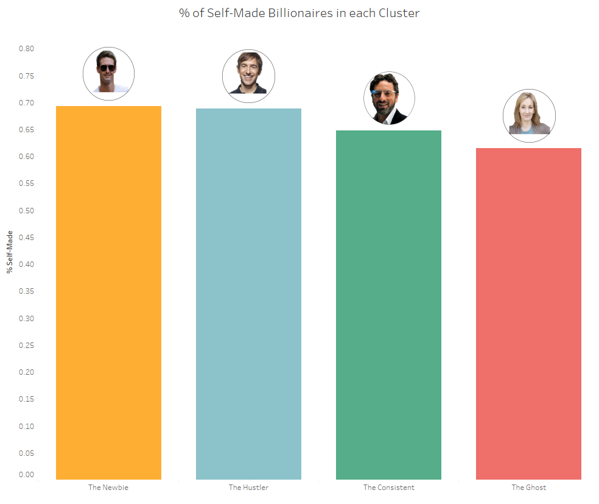
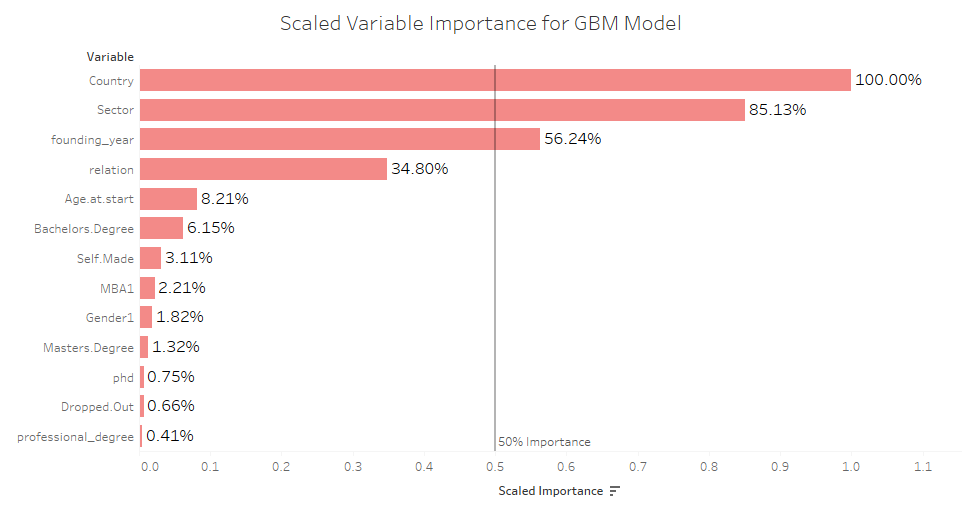

```{r setup, include=FALSE}
knitr::opts_chunk$set(echo = FALSE)
```

<p>Recently, I became a bit obsessed with the one percent of the one percent — Billionaires. I was intrigued when I stumbled on articles telling us who and what billionaires really are. The articles said stuff like: [Most entrepreneurs do not have a degree](https://www.virgin.com/entrepreneur/what-subjects-did-worlds-most-successful-entrepreneurs-study) and [the average billionaire was in their 30s before starting their business](https://www.forbes.com/sites/georgedeeb/2015/04/16/does-age-matter-for-entrepreneurial-success/#50107ee330f1). I felt like this was a bit of a generalization and I’ll explain. Let’s take a look at Bill Gates and Hajime Satomi, the CEO of Sega. Both are billionaires but are they really the same? In the past decade, Bill Gates has been a billionaire every single year while Hajime has dropped off the Forbes’ list three times. Is it fair to put these two individuals in the same box, post nice articles and give nice stats when no one wants to be a Hajime? I think not — especially when, in this decade alone, inconsistent billionaires like Hajime make up over 50% of the total billionaire population. Addressing the differences between billionaires is what this post is about. We are going to highlight interesting facts about the consistent billionaires and ultimately, find out what separates the consistent billionaires from the rest.</p>

<p>Just what do I mean by consistent billionaires? Well, that’s what we’re here for. 🙂</p>

## For the Nerds Like Me, Here’s How I did It

* **Data Sources**: Most of the data was scraped from 3000 Forbes profiles. Two extra variables were collected from a research paper: The Billionaire Characteristics Database. Billionaires covered are those who are or have been billionaires between 2007 and June, 2017.

* **Data Gathering**: Using names of billionaires I created their Forbes profile URLs and collected the data I needed using RSelenium and rvest. I’ll be frank. It was not sexy at all. I did a lot of Excel VLOOKUPS, manual inspections and string manipulation to get a workable data set.

* **Data Cleaning**: I created columns from strings using stringr.

<p>The [code](https://github.com/RosebudAnwuri/TheArtandScienceofData/tree/master/Consitent%20Billionaire%20Guide) can be found here.</p>

## Just How Many Types of Billionaires Are There?
Here’s what I came up with:

* **The Consistent**: These, as the name implies, are individuals who have consistently been billionaires year in and year out. It also includes billionaires that have been away from the list for at most a year (e.g. Mark Zuckerberg in 2008). They should have been billionaires before 2015.

* **The Ghosts**: These are billionaires who left the list and have not returned in the past four years. They also should have made their debut before 2015.

* **The Hustlers**: This category includes every other billionaire who made their debut before 2015. I.e.
+ Those that left more than once and made a comeback each time.
+ Those who, although made it back to the list, spent more than a year away.
+ Those who are yet to come back but have not spent up to 4 years off the list.

* **The Newbies**: These are billionaires that made their debut between 2015 and 2017. They are in a group of their own because I believe it would be unfair to put them in anywhere else as there isn’t enough data to classify them in any other category. Nonetheless, I think it would be interesting to see what they’re up to.

<p>So, let’s get to it!</p>

## Did You Know That?

### The Consistent billionaires are well-educated.

<p>Close to 55% of the Consistent billionaires have at least one degree.</p>

 

<p>In fact, the Consistent billionaires have the most people with a Bachelor’s, PhD, Masters and pretty much every other degree.</p>

### The average Consistent billionaire started their businesses at an age seven years older than the average Ghost.

<p>This applies to billionaires who are self-made and started a business. The average Consistent billionaire starts their business in their 30s on average which agrees with the [article](https://www.forbes.com/sites/georgedeeb/2015/04/16/does-age-matter-for-entrepreneurial-success/#50107ee330f1) on successful starting their 30s.</p>

 

<p>Does the Ghost billionaire starting his/her business at least two years earlier than everyone else say something about younger entrepreneurs being less likely to sustain their wealth? Probably. However, if you look at the Newbies, they mostly started out young too. The question is: Will the average Newbie end up a Ghost or has the playing field changed in the past few years? We can answer that in a few years. 🙂</p>

### The top three sectors that produce the highest percentage of Consistent billionaires are Telecoms, Fashion and Diversified portfolios.

 

<p>Looks extremely mainstream, right? But Fashion? Really?</p>

*Note: Fashion and Retail here does not mean Retail. It means businesses retailing Fashion merchandises like Zara, H & M etc.*

### African billionaires are the most likely to be Consistent billionaires

<p>Close to 70% of African billionaires are Consistent—more than any other region in the world. The region that comes closest is North America with 53%.</p>

 

<p>In the Newbie Era, however, Asia seems to be dominating every other region and this number is mostly driven by China. In fact, over 50% of Chinese billionaires joined the list during this period.</p>

<p>On the other hand, Middle Eastern billionaires are the most likely to be Ghosts. I know what you’re thinking. Oil prices, right? Probably. However, most of Middle Eastern billionaires have diversified portfolios.</p>

### There are more billionaires with a PhD than there are drop outs.

<p>This is my favorite.</p>

<p>This applies to all other degrees like MBA, MSc etc. Only professional degrees like Law or Medicine have fewer billionaires than drop outs. However, in the Newbie and Hustler categories, there are even more people with a professional degree than there are drop outs.</p>

 

### 11% of Consistent billionaires are female.

 

<p>The only category with a more encouraging female-to-male ratio is the Newbie category with about 16 percent. However, given that the global male to female ratio is 50:50, the Newbie category is still 34 percent short. The good news is things are getting better. A woman is close to two times more likely to be a billionaire since 2015 than before that.</p>

### 64% of Consistent billionaires are self-made.

 

<p>The only category with a lower percentage is The Ghost. The good news (or bad news — depending on where you hope your wealth would come from) is that the Newbie billionaire has a higher percentage than that. This means that in recent times, more “new” wealth is being generated. Also, it seems being self-made isn’t a peculiar thing seeing as each category has over 60% of their billionaires being self-made.</p>

## Cool, Now What?

<p>The billionaires we all know and love are well-educated and frankly, generally boring.</p>

**“How much does this matter if you want to become a Consistent billionaire?”**

<p>To answer that, we will do a bit of Machine Learning (bear with me here, it might get a little technical). Using the [h2o.ai](https://www.h2o.ai/h2o/) machine learning package (I love!), we would train models to predict what category a billionaire will fall into. We would do this for all the categories except The Newbie because, unlike the others, all that distinguishes this group is when they joined the list and not their performance while on it. We would also use truly independent variables to train our models. For example, a variable that was used to create the categories like the number of times they left the list won’t be used. It would be like knowing the answer and working backward if we use variables like that, right? We would then check which variables were the best in predicting a billionaire’s category to answer our question. The [code](https://github.com/RosebudAnwuri/TheArtandScienceofData/tree/master/Consitent%20Billionaire%20Guide/scripts) is also available in the same script shared above.</p>

<p>I would first use the purrr and h2o package to find the best algorithm between Gradient Boosting Machines, Random Forest, and Deep Learning.</p>


<p>Looks like the accuracy of the GBM algorithm on the test set beats the other machine learning algorithms.</p>

<p>Let’s check what variables GBM considers most important in predicting a billionaire’s category.</p>



<p>We see three variables above the 50% relative importance: Country, Sector and the founding year of the company that got them their wealth.</p>

<p>What does this tell us about Consistent billionaires? For one, it says that while the Consistent may be well educated, that’s certainly not what got them there. It’s not shocking that Country and Sector are important variables but “founding_year” is intriguing. It could mean that it may be getting easier or harder to build a sustainable business.</p>

<p>Again, pretty straightforward and boring. Be in an enabling environment at the right time for the sector you play in and BOOM! You make sustainable wealth. At this point, I feel I am obligated to say that 84% of technology billionaires are in North America and Asia. There are currently none from Africa (See sentence above about an enabling environment for your sector) but then again, you can be the pioneer so take my advice with a bag of salt. Good luck!</p>

## Things to Keep in Mind

* The data was gotten from Forbes. This means that I am inherently constrained by their methods, estimates, and errors. For example, the data says there is only one billionaire from Politics. I’d rather die<span style='font-size:6pt;'>zani</span> than believe that’s true.

* At the end of the day, I ended up with over 30 variables and I cannot talk about all of them in one post, so here are some [visualizations](https://public.tableau.com/profile/rosebud.anwuri#!/vizhome/BillionairesClusters/Visuals) for you to play around and find out for yourself how to become a Consistent billionaire. 😉

* Want to find out who the Consistent billionaires are? Find out using the full data set [here](https://github.com/RosebudAnwuri/TheArtandScienceofData/tree/master/Consitent%20Billionaire%20Guide/data).

* In my next post, I am going to address what sectors, countries and founding years are the best in becoming a consistent billionaire and;

* I have a LITTLE surprise. 🙂
